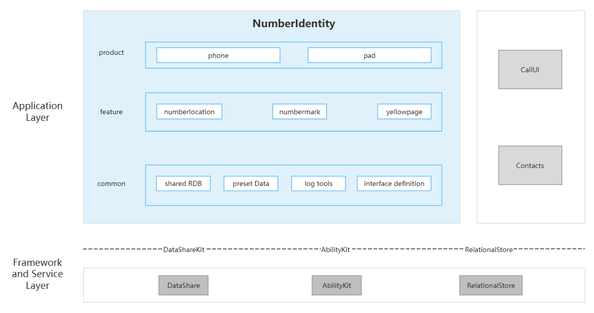

# Number Identity

## Introduction

**Number Identity** (bundle name: `com.ohos.numberidentity`) is a system component in the OpenHarmony telephony subsystem. It is deployed as a system HAP plus native shared library, providing **number location, number marking, and yellow pages** capabilities, and exposing DataShare data services to call and contacts applications.

### Core Capabilities

**Number Location**
- Supports querying number location and carrier information from local data files `numberlocation.data` and `numberlocation.dat`.
- Exposes DataShare query services through `com.ohos.numberlocationability`.

**Number Marking**
- Supports marking unknown numbers (spam, fraud, advertising, and so on), plus query, update, and delete.
- Data is written to `number_mark` related tables and served through `com.ohos.numbermarkability`.

**Yellow Pages**
- Supports parsing `yellowpage.data`, importing it into RDB, and matching yellow-page records during query.
- Parsing is handled by the `yellow_page/` module; import goes through `NumberIdentityDatabase::ImportYellowPageData`.

## Architecture

Number Identity uses a layered, modular design organized by product entry, feature capabilities, and common capabilities, as shown below:



### Application Layer Design

The overall structure is divided into product layer, feature layer, and common layer:

| Layer | Main directories / components | Description |
| ----- | --------------------------- | ----------- |
| Product layer | `entry` (phone / pad) | Phone / tablet forms |
| Feature layer | `number_location/`, `number_mark/`, `yellow_page/` | Number location, number marking, and yellow pages |
| Common layer | `shared/`, `etc/`, `utils/`, `interfaces/` | Shared database, preset data, log tools, and interface definitions |

**Feature layer module description**:

| Core capability | Modules | Description |
| --------------- | ------- | ----------- |
| Number location | `number_location/` (`NumberLocationManager`, `NumberLocationAbility`) | Location parsing and DataShare query |
| Number marking | `number_mark/` (`NumberMarkManager`, `NumberMarkAbility`) | User mark maintenance and query |
| Yellow pages | `yellow_page/` (`YellowPageParser`) | Yellow-page file parsing and RDB import |

### Relationship with Other Applications

Number Identity provides yellow-page, location, and mark number-data services to system apps such as **CallUI** and **Contacts**. It does not host call or contacts UI itself; core telephony capabilities are provided by the Telephony subsystem.

**Invocation**:

- CallUI and Contacts access URIs such as `com.ohos.numberlocationability` and `com.ohos.numbermarkability` through DataShare Helper.

**Invocation scenarios**:

Showing marks and location on the incoming-call UI, resolving numbers in contacts details, user marking of unknown numbers, and similar flows.

## Build

This project supports **standalone Hvigor HAP builds** and **OpenHarmony system GN integration** (HAP + native shared library + prebuilt data). The product bundle name is `com.ohos.numberidentity`.

### Environment Requirements
- OpenHarmony SDK (Hvigor project `compileSdkVersion` is 23; `compatibleSdkVersion` / `targetSdkVersion` are 20)
- OpenHarmony source tree (component path: `base/telephony/number_identity`) and GN toolchain (for system integration)
- DevEco Studio or command-line Hvigor
- System signing configuration (see `signature/`)

### Build Commands

Run Hvigor in the project root (requires `hvigorw` on PATH, or use DevEco Studio):

```bash
hvigorw assembleHap
```

For system-tree integration, run from the OpenHarmony source root:

```bash
./build.sh --product-name {product_name} --build-target number_identity --ccache
```

> **Note**: For standalone development, place the project under `base/telephony/number_identity` and build with the system, or configure system signing and build with Hvigor.

## Number Identity Development

Number Identity uses **ArkTS + C++** hybrid development: DataShare and yellow-page / location / mark core live in the C++ feature layer; ArkTS handles Extension declarations and service extensions. For ArkTS page extensions, see: [ArkUI Development Overview](https://gitcode.com/openharmony/docs/blob/master/zh-cn/application-dev/ui/arkts-ui-development-overview.md)

### Development Based on Existing Modules

Typical use cases: customize existing location / yellow-page / mark capabilities, such as supplementing preset data or adjusting mark-query interaction.

Common modification scenarios:

**Scenario 1: Add / update `numberlocation.data`**

   - Source: `etc/numberlocation.data`
   - Install: `number_location_data_default` in `etc/BUILD.gn` → `/system/etc/telephony/numberlocation.data`
   - At runtime you may also place the file under the sandbox path: `/data/storage/el2/base/files/numberlocation.data`

For example, to add a prefix record, append to `numberlocation.data`:
```text
    // numberlocation.data
    {"version":"1"}
    {"prefix":"1810256","province":"广东","city":"广州","operator":"电信"}
    ...
```

**Scenario 2: Add / update `numberlocation.dat`**

   - In addition to the JSON text format `numberlocation.data`, number location also supports the binary format `numberlocation.dat`: the former is readable JSON-line data that is easy to edit by prefix; the latter is a compact binary location library, loaded and parsed by `number_location/src/number_location_db_parse.cpp` (for example `QueryPhoneNumberLocation`, `QueryTelNumberLocation`)
   - Place the source file at `etc/numberlocation.dat`; the system preset install path is `/system/etc/telephony/numberlocation.dat`
   - At runtime you may also place a full file under the sandbox path: `/data/storage/el2/base/files/numberlocation.dat`
   - The repository does not ship a full `.dat` sample by default; the production binary must be prepared by the product

Suggested add / update steps:

1. **Preset with the system image**: Put the target `numberlocation.dat` under `etc/`, enable the corresponding preset install target, build it into the image with system GN, and install it to `/system/etc/telephony/numberlocation.dat`.
2. **Replace on device**: Use `hdc` to push the new file to the sandbox path `/data/storage/el2/base/files/numberlocation.dat`. To overwrite the system preset directory, remount or otherwise gain write access to the system partition, then push to `/system/etc/telephony/numberlocation.dat`.
3. **Make it take effect**: After replacing the file, restart the related process or the device so the location library is reloaded, then verify query results.

**Scenario 3: Number marking**

   - Core: `number_mark/src/number_mark_ability.cpp`, `number_mark_manager.cpp`
   - CRUD is routed to `NumberMarkAbility` through `com.ohos.numbermarkability`

For example, to add custom handling after a local yellow-page hit, extend `QueryByPhoneNumber`:
```cpp
    // number_mark_ability.cpp
    int NumberMarkAbility::QueryByPhoneNumber(
        const string &phoneNumber, NumberMarkInfo &markInfo, DatashareBusinessError &businessError)
    {
      ...
      if (auto it = FindYellowPageBestMatch(phoneNumber, yellowPages); it.has_value()) {
        // [Change point] extend custom handling here after a yellow-page hit
        // CustomProcessYellowPage(*it);
        markInfo.FromYellowPage(*it);
        return SetBusinessError(businessError, errCode);
      }
      ...
    }
```

**Scenario 4: Add / update yellow-page `yellowpage.data`**

   - Source: `etc/yellowpage.data`
   - Parsing: `yellow_page/src/yellow_page_parser.cpp`
   - Install: `yellow_page_default` in `etc/BUILD.gn` → `/system/etc/telephony/yellowpage.data`
   - Import: `NumberIdentityDatabase::ImportYellowPageData`

For example, to import yellow-page data by path:
```cpp
    // shared
    // [Change point] replace the import path or extend pre/post import handling as needed
    NumberIdentityDatabase::ImportYellowPageData(
        "/data/storage/el2/base/files/yellowpage.data");
```

Common modification entries:

| Target | Path |
| ------ | ---- |
| Process initialization | `entry/src/main/ets/Application/NumberLocationAbilityStage.ts` |
| DataShare routing | `number_location/src/number_identity_datashare_stub_impl.cpp` |
| Number location | `number_location/src/number_location_ability.cpp`, `number_location_manager.cpp`, `number_location_utils.cpp`, `number_location_db_parse.cpp` |
| Location / yellow-page preset data | `etc/numberlocation.data`, `etc/yellowpage.data`, `etc/numberlocation.dat`, `etc/BUILD.gn` |
| Number marking | `number_mark/src/number_mark_ability.cpp` |
| Yellow pages | `yellow_page/src/yellow_page_parser.cpp`, `ImportYellowPageData` in `shared` |
| Mark-data IPC service | `entry/src/main/ets/service/NumberIdentityServiceExtAbility.ts` |
| RDB and models | `shared/` |
| Ability / DataShare declaration | `entry/src/main/module.json5` |

### Developing New Feature Capabilities

Typical use cases: extend location / yellow-page / mark dimensions, add DataShare URIs, or support additional data-file formats.

> **Note**: Feature-layer code must be registered into the `number_identity` shared library in the root `BUILD.gn`. External URIs and permissions must stay consistent with consumers such as CallUI and Contacts.

**Scenario 1: Extend C++ feature modules**

1. Add implementations under `number_location/`, `number_mark/`, or `yellow_page/`.
2. Register sources in `ohos_shared_library("number_identity")` in `BUILD.gn`.
3. Add gtest cases under `test/unittest/` and register them in the corresponding `BUILD.gn`.

**Scenario 2: Declare DataShare and permissions**

For a new DataShare URI, update `NumberIdentityDataShareStubImpl::GetOwner` and `entry/src/main/module.json5` together. Example of the existing mark capability declaration:

```json
{
  "name": "NumberMarkAbility",
  "srcEntry": "./ets/DataShareExtAbility/DataShareExtAbility.ts",
  "readPermission": "ohos.permission.GET_TELEPHONY_STATE",
  "writePermission": "ohos.permission.SET_TELEPHONY_STATE",
  "type": "dataShare",
  "uri": "datashare://com.ohos.numbermarkability",
  "visible": true
}
```

## Directory

```text
number_identity
├─AppScope                              # App-level configuration and multi-language resources
│  ├─app.json5                          # Hvigor bundle name, version, and so on
│  ├─app.json                           # App configuration used by system GN builds
│  └─resources/                         # Global string resources and so on
├─figures/                              # Architecture figure
├─entry                                 # Product layer
│  └─src/main/
│     ├─ets/
│     │  ├─Application/                 # Process initialization
│     │  ├─DataShareExtAbility/         # DataShare extension declaration
│     │  ├─service/                     # Mark-data IPC service extension
│     │  ├─pages/                       # Page entry
│     │  ├─common/                      # Constants, logging, connection utilities
│     │  └─backup/                      # Backup/restore extension
│     ├─resources/                      # Module resources and configuration
│     ├─module.json5                    # Ability, DataShare, and permission declarations
│     └─module.json                     # System GN module configuration
├─number_location/                      # Feature layer: number location
│  ├─include/
│  └─src/                               # Location management, parsing, Ability, and so on
├─number_mark/                          # Feature layer: number marking
│  ├─include/
│  └─src/                               # Mark ability and manager implementations, and so on
├─yellow_page/                          # Feature layer: yellow pages
│  ├─include/
│  └─src/                               # Yellow-page parsing implementation, and so on
├─shared/                               # Common layer: shared database
├─frameworks/                           # Common layer: framework-related implementation
├─interfaces/                           # Common layer: interface definitions
├─etc/                                  # Common layer: preset data
├─utils/log/                            # Common layer: log tools
├─tools/                                # Helper tools
├─test/                                 # Unit tests and fuzz tests
├─signature/                            # Signing configuration
├─hvigor/                               # Hvigor build configuration
├─BUILD.gn                              # System GN build entry
├─bundle.json                           # Component ownership and build groups
├─build-profile.json5                   # Project-level SDK configuration
├─oh-package.json5
├─OAT.xml                               # Open-source compliance audit
├─LICENSE
├─README.md                             # English README
└─README_zh.md                          # Chinese README
```

## Constraints

- **Language**: ArkTS + C++
- **Runtime form**: Pre-installed system component (`com.ohos.numberidentity`), deployed as HAP + native shared library + prebuilt data; capabilities are provided by `extensionAbilities`
- **Device types**: Phone and tablet (see `entry/src/main/module.json5`)
- **Signing**: Requires system signing configuration (see `signature/`)
- **Permissions**: Main permissions for Number Identity are as follows (see `requestPermissions` in `entry/src/main/module.json5`; some extensions also declare `SET_TELEPHONY_STATE`)

  | Permission | Grant mode | Usage |
  | ---------- | ---------- | ----- |
  | ohos.permission.GET_TELEPHONY_STATE | System grant | DataShare read and telephony-state related queries |
  | ohos.permission.SET_TELEPHONY_STATE | System grant | Mark write and related operations |
  | ohos.permission.WRITE_CALL_LOG | System grant | Number-mark related scenarios |
  | ohos.permission.MANAGE_SETTINGS | System grant | Related system settings read/write |
  | ohos.permission.GET_BUNDLE_INFO | System grant | Query bundle info |

- **External dependencies**: CallUI and Contacts consume this component's data through DataShare; the Telephony subsystem provides underlying capabilities

## Contributing

Contributions of code and documentation are welcome. For the contribution process, see [Contributing](https://gitcode.com/openharmony/docs/blob/master/zh-cn/contribute/%E5%8F%82%E4%B8%8E%E8%B4%A1%E7%8C%AE.md).

## Related Repositories

[**callui**](https://gitcode.com/openharmony/applications_call)

[**contacts**](https://gitcode.com/openharmony/applications_contacts)
