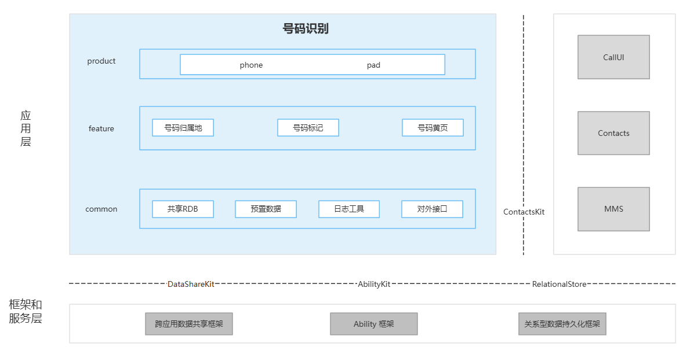

# 号码识别（Number Identity）

## 简介

**号码识别**（包名：`com.ohos.numberidentity`）是 OpenHarmony 电话子系统中的系统部件，以系统 HAP 与原生共享库形式部署，提供**号码归属地、号码标记与号码黄页**等能力，并向通话、联系人、短信等应用提供 DataShare 数据服务。

工程已随部件预置本地号码数据，当前仓库示例包括：

- 归属地文本库 `etc/numberlocation.data`（JSON 行），例如：
```text
{"version":"1"}
{"prefix":"1810256","province":"广东","city":"广州","operator":"电信"}
{"prefix":"1371738","province":"广东","city":"东莞","operator":"移动"}
```
- 黄页预置库 `etc/yellowpage.data`（JSON 行，含运营商客服等记录），例如：
```text
{"version":"123"}
{"group":"电信","name":"中国移动","phone":[{"phone":"10086","name":"中国移动"},{"phone":"1008611","name":"中国移动"}]}
{"group":"电信","name":"中国联通","phone":[{"phone":"10010","name":"中国联通客服热线"},{"phone":"10011","name":"中国联通充值专线"}]}
```

### 核心能力

**号码归属地**
- 支持基于本地数据文件 `numberlocation.data`、`numberlocation.dat` 查询号码归属地与运营商信息。
- 经 `com.ohos.numberlocationability` 对外提供 DataShare 查询服务。

**号码标记**
- 支持对陌生号码打标（骚扰、诈骗、广告等）及查询、更新、删除。
- 数据写入 `number_mark` 相关表，经 `com.ohos.numbermarkability` 对外服务。

**号码黄页**
- 支持解析 `yellowpage.data` 并导入 RDB，查询时匹配黄页记录。
- 由 `yellow_page/` 模块完成解析，经 `NumberIdentityDatabase::ImportYellowPageData` 入库。

## 架构说明

Number Identity 采用分层与模块化设计，按产品入口、业务特性与公共能力组织代码，如图：



### 应用层分层设计

整体可划分为产品层、特性层、公共层：

| 层次   | 主要目录 / 组件 | 说明 |
|------| -------------- | ---- |
| 产品层 | `entry`（phone / pad） | 手机 / 平板形态 |
| 特性层 | `number_location/`、`number_mark/`、`yellow_page/` | 号码归属地、号码标记、号码黄页 |
| 公共层 | `shared/`、`etc/`、`utils/`、`interfaces/` | 共享数据库、预置数据、日志工具、对外接口 |

**特性层模块说明**：

| 核心能力   | 模块 | 说明 |
|--------|----------------|------|
| 号码归属地   | `number_location/`（`NumberLocationManager`、`NumberLocationAbility`） | 归属地解析与 DataShare 查询 |
| 号码标记   | `number_mark/`（`NumberMarkManager`、`NumberMarkAbility`） | 用户标记维护与查询 |
| 号码黄页   | `yellow_page/`（`YellowPageParser`） | 黄页文件解析与 RDB 导入 |

### 与其它应用的关系

Number Identity 向 **CallUI**、**Contacts**、**MMS（短信）** 等系统应用提供黄页、归属地、标记等号码数据服务，不直接承载通话、联系人或短信界面；电话核心能力由 Telephony 子系统提供。

预置数据（如 `etc/numberlocation.data`、`etc/yellowpage.data`、`etc/numberlocation.dat`）由号码识别部件维护；CallUI、Contacts、MMS 等消费方仅通过 DataShare 查询使用，不直接改写上述预置数据文件。

**调用方式**：

各消费方通过 `DataShareHelper` 访问号码识别对外 URI 路径（主要调用 `query`；标记写入走 `update`），例如：

| 消费方 | 主要调用 | URI 路径 |
|------|---------|---------|
| CallUI | `query` | `datashare:///com.ohos.numbermarkability/number_mark` |
| Contacts | `query` | `datashare:///com.ohos.numbermarkability/number_mark`、`.../yellow_page_view` |
| MMS | `query` | `datashare:///com.ohos.numbermarkability/yellow_page_view` |

另外，部件还通过 NAPI 对外提供 `getNumberLocation` / `getNumberLocations`（对应 `com.ohos.numberlocationability`）以及 `getNumberMarkInfo` / `setNumberMarkInfo`（对应 `.../number_mark_info`）。CallUI 界面上的归属地展示通常由通话侧先查询后随通话数据下发，CallUI 侧直接调用的是标记 `query`。

**调用场景**：

来电界面展示标记与归属地、联系人详情号码解析、用户标记陌生号码、短信会话展示黄页名称等。

## 编译构建

本工程支持 **Hvigor 独立构建 HAP** 与 **OpenHarmony 系统 GN 合入**（HAP + 原生共享库 + 预置数据），产物包名 `com.ohos.numberidentity`。

### 环境要求
- Openharmony SDK: compileSdkVersion 26, compatibleSdkVersion 23
- OpenHarmony 系统源码树（部件路径：`base/telephony/number_identity`）及 GN 工具链（系统合入时）
- DevEco Studio 或命令行 Hvigor
- 系统签名配置（见 `signature/`）

### 编译命令

在工程根目录执行 Hvigor 构建（需本机已配置 `hvigorw`，或使用 DevEco Studio）：

```bash
hvigorw assembleHap
```

系统源码树中合入时，在源码根目录执行：

```bash
./build.sh --product-name {product_name} --build-target number_identity --ccache
```

> **说明**：独立开发可将工程置于 `base/telephony/number_identity` 后随系统编译，或配置系统签名后使用 Hvigor 构建。

## Number Identity 开发

Number Identity 采用 **ArkTS + C++** 混合开发：DataShare 与黄页 / 归属地 / 标记核心在 C++ 特性层实现，ArkTS 负责 Extension 声明与服务扩展。扩展 ArkTS 页面可参考：[ArkUI 开发概述](https://gitcode.com/openharmony/docs/blob/master/zh-cn/application-dev/ui/arkts-ui-development-overview.md)

### 基于已有模块的开发

适用场景：对已有归属地 / 黄页 / 标记能力做功能定制，例如补充预置数据、调整标记查询交互等。

以下列举一些常见的修改场景：

**场景1：添加 / 修改归属地 `numberlocation.data`**

   - 源文件：`etc/numberlocation.data`
   - 安装：`etc/BUILD.gn` 中 `number_location_data_default` → `/system/etc/telephony/numberlocation.data`
   - 运行时亦可放到沙箱路径：`/data/storage/el2/base/files/numberlocation.data`

例如，需新增号段记录，可在 `numberlocation.data` 中追加：
```text
    // numberlocation.data
    {"version":"1"}
    {"prefix":"1810256","province":"广东","city":"广州","operator":"电信"}
    ...
```

**场景2：添加 / 修改归属地 `numberlocation.dat`**

   - 号码归属地除支持 JSON 文本格式的 `numberlocation.data` 外，还支持二进制格式的 `numberlocation.dat`：前者为可读的 JSON 行数据，便于直接增改号段；后者为二进制归属地库，体积更紧凑，由 `number_location/src/number_location_db_parse.cpp` 加载与解析（如 `QueryPhoneNumberLocation`、`QueryTelNumberLocation`）
   - 源文件置于工程 `etc/numberlocation.dat`；系统预置安装路径为 `/system/etc/telephony/numberlocation.dat`
   - 运行时亦可将完整文件放到沙箱路径：`/data/storage/el2/base/files/numberlocation.dat`
   - 仓库默认不附带完整 `.dat` 示例，正式库需由产品侧自行准备二进制文件

添加 / 修改操作建议：

1. **随系统镜像预置**：将目标 `numberlocation.dat` 放入 `etc/`，启用对应预置安装目标后随系统 GN 编入镜像，安装到 `/system/etc/telephony/numberlocation.dat`。
2. **设备侧替换**：用 `hdc` 将新文件推送到沙箱路径 `/data/storage/el2/base/files/numberlocation.dat`；若需覆盖系统预置目录，须具备 remount 等写系统分区条件，再推送到 `/system/etc/telephony/numberlocation.dat`。
3. **生效方式**：替换文件后重启相关进程或设备，使归属地库重新加载后再验证查询结果。

**场景3：号码标记**

   - 核心位于 `number_mark/src/number_mark_ability.cpp`、`number_mark_manager.cpp`
   - 增删改查经 `com.ohos.numbermarkability` 路由至 `NumberMarkAbility`
   - 标记查询入口为 `QueryByPhoneNumber`：先匹配本地黄页，未命中再查用户本地标记

例如，需在用户标记命中后增加自定义处理，可在 `QueryByPhoneNumber` 中扩展：
```cpp
    // number_mark_ability.cpp
    auto mark = find_if(numberMarks.cbegin(), numberMarks.cend(), IsUserMark);
    if (mark != numberMarks.cend()) {
      // 【修改点】用户标记命中后可在此扩展自定义处理
      // CustomProcessNumberMark(*mark);
      markInfo.FromNumberMark(*mark);
      return SetBusinessError(businessError, errCode);
    }
    ...
```

**场景4：写入号码标记数据**

   - 对外写入口为 DataShare `Update`（`Insert` 不支持），URI：`datashare:///com.ohos.numbermarkability/number_mark_info`（需 `SET_TELEPHONY_STATE`）
   - 实现：`NumberMarkAbility::Update` → `SetNumberMark`（`number_mark_ability.cpp`）
   - 必填：`phoneNumber`、`markType`；自定义标记另需 `customMarkContent`；`markType` 为 `MARK_TYPE_NONE` 表示删除

例如，写入一条骚扰标记：
```cpp
    // number_mark_ability.cpp — SetNumberMark 写入入口
    Uri uri("datashare:///com.ohos.numbermarkability/number_mark_info");
    DataShareValuesBucket values;
    values.Put(SetNumberMarkParamsFields::phoneNumber, "12345678901");
    values.Put(SetNumberMarkParamsFields::markType, static_cast<int64_t>(MarkType::MARK_TYPE_CRANK));
    // 【修改点】可改为自定义标记并补充 customMarkContent，或设为 MARK_TYPE_NONE 删除
    ...
    ability->Update(uri, predicates, values);
```

**场景5：添加 / 修改号码黄页 `yellowpage.data`**

   - 源文件：`etc/yellowpage.data`
   - 解析：`yellow_page/src/yellow_page_parser.cpp`
   - 安装：`etc/BUILD.gn` 中 `yellow_page_default` → `/system/etc/telephony/yellowpage.data`
   - 导入：`NumberIdentityDatabase::ImportYellowPageData`

例如，需按路径导入黄页数据，可调用：
```cpp
    // shared
    // 【修改点】按需替换导入路径或扩展导入前后处理
    NumberIdentityDatabase::ImportYellowPageData(
        "/data/storage/el2/base/files/yellowpage.data");
```

常用修改入口：

| 目标 | 路径 |
|------|------|
| 进程初始化 | `entry/src/main/ets/Application/NumberLocationAbilityStage.ts` |
| DataShare 路由 | `number_location/src/number_identity_datashare_stub_impl.cpp` |
| 号码归属地 | `number_location/src/number_location_ability.cpp`、`number_location_manager.cpp`、`number_location_utils.cpp`、`number_location_db_parse.cpp` |
| 归属地 / 黄页预置数据 | `etc/numberlocation.data`、`etc/yellowpage.data`、`etc/numberlocation.dat`、`etc/BUILD.gn` |
| 号码标记 | `number_mark/src/number_mark_ability.cpp` |
| 号码黄页 | `yellow_page/src/yellow_page_parser.cpp`、`shared` 中 `ImportYellowPageData` |
| 标记数据 IPC 服务 | `entry/src/main/ets/service/NumberIdentityServiceExtAbility.ts` |
| RDB 与模型 | `shared/` |
| Ability / DataShare 声明 | `entry/src/main/module.json5` |

### 新特性能力的开发

适用场景：扩展归属地 / 黄页 / 标记维度、新增 DataShare URI 或补充数据文件格式支持。

> **说明**：特性层代码需编入根目录 `BUILD.gn` 的 `number_identity` 共享库；对外 URI 与权限需与 CallUI、Contacts、MMS 等消费方约定一致。

**场景1：扩展 C++ 特性模块**

1. 在 `number_location/`、`number_mark/` 或 `yellow_page/` 下新增实现。
2. 在 `BUILD.gn` 的 `ohos_shared_library("number_identity")` 中注册源文件。
3. 在 `test/unittest/` 中补充 gtest 并在对应 `BUILD.gn` 注册。

**场景2：声明 DataShare 与权限**

如需新 DataShare URI，同步更新 `NumberIdentityDataShareStubImpl::GetOwner` 与 `entry/src/main/module.json5`，例如现有标记能力声明：

```json
{
  "name": "NumberMarkAbility",
  "srcEntry": "./ets/DataShareExtAbility/DataShareExtAbility.ts",
  "readPermission": "ohos.permission.GET_TELEPHONY_STATE",
  "writePermission": "ohos.permission.SET_TELEPHONY_STATE",
  "type": "dataShare",
  "uri": "datashare://com.ohos.numbermarkability",
  "visible": true
}
```

## 目录

```text
number_identity
├─AppScope                              # 应用级配置与多语言资源
│  ├─app.json5                          # Hvigor 包名、版本号等
│  ├─app.json                           # 系统 GN 构建使用的应用配置
│  └─resources/                         # 全局字符串等资源
├─figures/                              # 架构说明图
├─entry                                 # 产品层
│  └─src/main/
│     ├─ets/
│     │  ├─Application/                 # 进程初始化
│     │  ├─DataShareExtAbility/         # DataShare 扩展声明
│     │  ├─service/                     # 标记数据 IPC 服务扩展
│     │  ├─pages/                       # 页面入口
│     │  ├─common/                      # 常量、日志、连接工具
│     │  └─backup/                      # 备份恢复扩展
│     ├─resources/                      # 模块资源与配置
│     ├─module.json5                    # Ability、DataShare、权限声明
│     └─module.json                     # 系统 GN 模块配置
├─number_location/                      # 特性层：号码归属地
│  ├─include/
│  └─src/                               # 归属地管理、解析与 Ability 等
├─number_mark/                          # 特性层：号码标记
│  ├─include/
│  └─src/                               # 标记能力与管理实现等
├─yellow_page/                          # 特性层：号码黄页
│  ├─include/
│  └─src/                               # 黄页解析实现等
├─shared/                               # 公共层：共享数据库
├─frameworks/                           # 公共层：框架相关实现
├─interfaces/                           # 公共层：接口定义
├─etc/                                  # 公共层：预置数据
├─utils/log/                            # 公共层：日志工具
├─tools/                                # 辅助工具
├─test/                                 # 单元测试与模糊测试
├─signature/                            # 签名配置
├─hvigor/                               # Hvigor 构建配置
├─BUILD.gn                              # 系统 GN 构建入口
├─bundle.json                           # 部件归属与构建分组
├─build-profile.json5                   # 工程级 SDK 配置
├─oh-package.json5
├─OAT.xml                               # 开源合规审计
├─LICENSE
├─README.md                             # 英文说明文档
└─README_zh.md                          # 中文说明文档
```

## 约束

- **语言版本**：ArkTS + C++
- **运行形态**：系统预置部件（`com.ohos.numberidentity`），以 HAP + 原生共享库 + 预置数据部署；能力由 `extensionAbilities` 提供
- **设备类型**：手机、平板（见 `entry/src/main/module.json5`）
- **签名要求**：须使用系统签名配置（见 `signature/`）
- **权限**：号码识别主要权限如下（见 `entry/src/main/module.json5` 的 `requestPermissions`；部分 extension 另声明 `SET_TELEPHONY_STATE`）

  | 权限 | 授权方式 | 使用场景 |
  |------|---------|----------|
  | ohos.permission.GET_TELEPHONY_STATE | 系统授权 | DataShare 读、电话状态相关查询 |
  | ohos.permission.SET_TELEPHONY_STATE | 系统授权 | 标记写入等 |
  | ohos.permission.WRITE_CALL_LOG | 系统授权 | 号码标记相关场景 |
  | ohos.permission.MANAGE_SETTINGS | 系统授权 | 相关系统设置项读写 |
  | ohos.permission.GET_BUNDLE_INFO | 系统授权 | 查询应用包信息 |

- **外部依赖**：CallUI、Contacts、MMS 通过 DataShare 消费本部件数据；Telephony 子系统提供底层能力

## 参与贡献

欢迎广大开发者贡献代码、文档等，具体的贡献流程和方式请参见[参与贡献](https://gitcode.com/openharmony/docs/blob/master/zh-cn/contribute/%E5%8F%82%E4%B8%8E%E8%B4%A1%E7%8C%AE.md)。

## 相关仓

[**callui**](https://gitcode.com/openharmony/applications_call)

[**contacts**](https://gitcode.com/openharmony/applications_contacts)

[**mms**](https://gitcode.com/openharmony/applications_mms)
