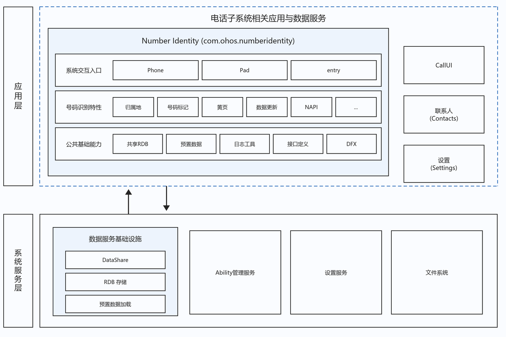
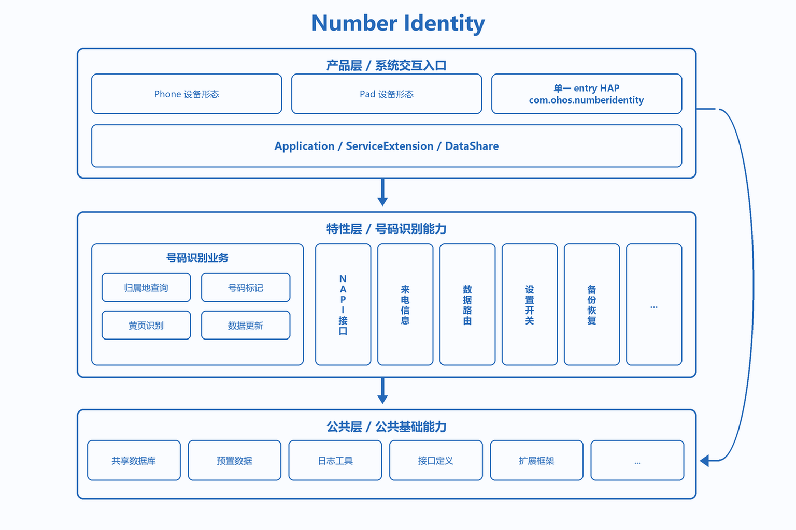
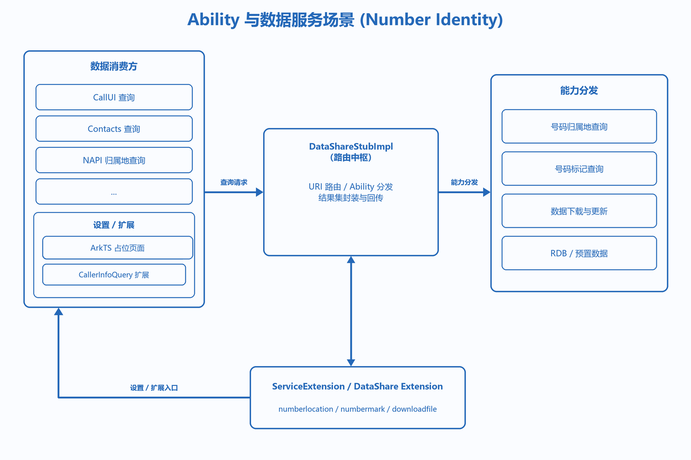
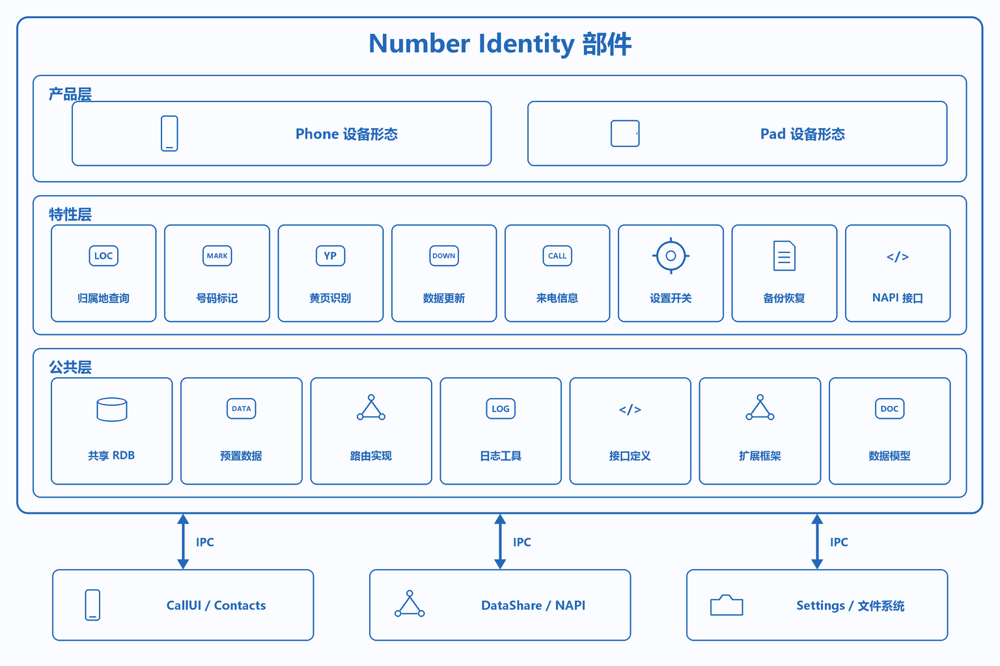
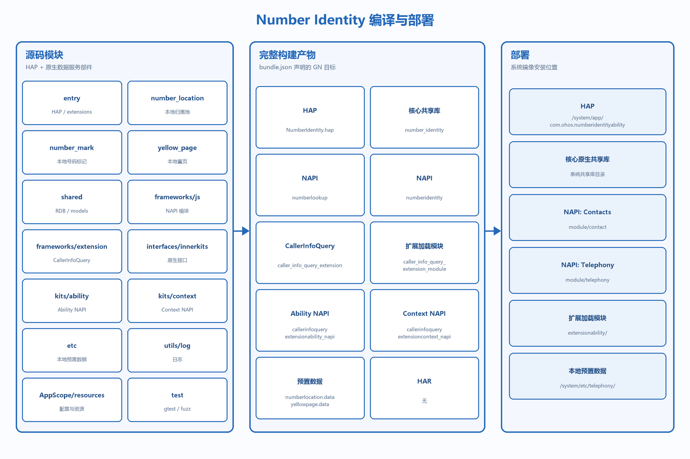

# Number Identity

## 简介
**Number Identity**（包名：`com.ohos.numberidentity`）是 OpenHarmony 电话子系统中的 **号码识别部件**，提供号码归属地查询、号码标记（来电识别）、黄页识别、来电信息查询扩展，以及相关本地数据存储与 DataShare 服务。

本部件为系统预置组件，以 **系统 HAP + 原生共享库** 形式部署。号码标记、号码识别等功能依赖设备端的**本地数据库 / 数据文件**；识别与展示结果均从本地数据库或数据文件读取，**无在线识别功能**。工程中预置数据文件为 **`etc/numberlocation.data`**、**`etc/yellowpage.data`**，设备侧路径为 **`system/etc/telephony/`**。

### 核心能力

**号码归属地查询**
- 基于本地预置 / 更新数据文件（`numberlocation.data` / `numberlocation.dat`）解析，返回省 / 市 / 运营商等信息。
- 通过 `NumberLocationManager`、`MobilePhoneNumber` 与 `FixPhoneNumber` 实现手机号号段匹配、固话区号匹配及号码格式处理。
- 对外通过 DataShare URI `com.ohos.numberlocationability` 与 NAPI `getNumberLocation` 暴露。

> Number Identity 的定位是电话子系统的数据服务部件，DataShare 核心逻辑在 C++ 层实现，而非纯 ArkTS 应用。

**号码标记与黄页识别**
- 支持用户对陌生号码打标（骚扰、诈骗、广告推销等），写入 `number_mark` 表。
- 黄页数据通过 `yellow_page` 模块解析 `yellowpage.data` 导入 RDB，优先于社区标记展示。
- 当前生产查询顺序为本地黄页 → 本地用户标记；`number_identity_switch` 仅控制未命中后的开关判断。工程保留智能库数据导入 / 存储与 HSDR Helper 代码，但尚未接入 `QueryByPhoneNumber` 主查询链路。

**DataShare 数据服务**
- 统一 `NumberIdentityDataShareStubImpl` 路由三个 DataShare Extension：
  - `com.ohos.numberlocationability` → 归属地查询
  - `com.ohos.numbermarkability` → 号码标记查询、更新、删除与批量导入
  - `com.ohos.downloadfileability` → 数据下载 / 更新

**来电信息查询扩展**
- `CallerInfoQueryExtensionAbility` 框架支持第三方应用扩展企业来电信息查询。
- 通过 `interfaces/kits/` 对外暴露 Extension 声明与 Context 类型。

**数据更新与生命周期**
- `DownloadFileWorkSheduler` 按网络策略定时下载归属地 / 黄页数据文件；下载完成后写入本地文件或数据库，识别查询不发起在线请求。
- `NumberIdentityServiceExtAbility` 支持号码标记数据包 IPC 导入。
- `BackupExtension` 提供备份恢复扩展；RDB 版本升级自动迁移。

### Number Identity 与 CallUI / Contacts 的关系

Number Identity、CallUI、Contacts 都是电话子系统生态中的部件，CallUI 与 Contacts **消费** Number Identity 提供的数据服务。

**事件与调用关系上**：
1. Number Identity 以独立应用进程运行，原生 `number_identity` 共享库在进程加载时注册 DataShare 创建器。
2. CallUI、Contacts 通过 DataShare Helper 或 NAPI 跨进程查询号码信息。
3. Number Identity 不直接与通话 UI 交互，通过 DataShare / NAPI 提供间接数据服务。

> 例如，一次典型的来电标记展示流程：
> - CallUI 收到来电事件，获取来电号码；
> - 通过 DataShare 查询 `com.ohos.numbermarkability`；
> - `NumberMarkAbility` 按优先级查询黄页 / 标记数据；
> - 返回 `NumberMarkInfo` 结果集，CallUI 在通话界面展示。

## 架构说明

Number Identity 采用分层与模块化设计，并与通话 / 联系人等消费方协同工作。

### 在系统中的定位

Number Identity 位于应用 / 数据服务层，通过 DataShare 与 NAPI 向 CallUI、Contacts 等提供号码识别能力，依赖 RDB 与预置数据完成本地解析。



### 分层设计

整体可划分为产品层（entry HAP）、特性层（归属地 / 标记 / 黄页）、公共层（RDB / NAPI / 预置数据），如图：



| 层次 | 主要目录 / 组件 | 说明 |
| ---- | --------------- | ---- |
| 产品层 / 应用入口 | `entry/` | HAP 打包、ArkTS 占位页、ServiceExtension、DataShare 声明、备份扩展 |
| 特性层 / 号码识别业务 | `number_location/`、`number_mark/`、`yellow_page/` | 归属地解析、标记查询与维护、黄页导入、数据下载 |
| 公共层 / 基础能力 | `shared/`、`etc/`、`utils/`、`frameworks/`、`interfaces/` | RDB、预置数据、日志、NAPI、CallerInfoQuery 扩展与类型定义 |

### Ability 与数据服务场景

消费方经 DataShare / NAPI 进入，由 StubImpl 路由到对应 Ability，再访问 RDB 与预置数据：



**数据流概览**：

```text
CallUI / Contacts / NAPI
  → DataShare Helper / getNumberLocation
  → NumberIdentityDataShareStubImpl
  → NumberLocationAbility / NumberMarkAbility / DownloadFileAbility
  → shared RDB + etc 预置数据
  → ResultSet / NumberMarkInfo 回传
```

### 部件与外部依赖

部件内部按产品 / 特性 / 公共能力组织，通过 DataShare、NAPI、Settings 服务和文件系统完成跨进程协作：



### 模块说明

| 模块 | 路径 | 说明 |
| ---- | ---- | ---- |
| 应用入口 | entry/src/main/ets/Application/ | NumberLocationAbilityStage 进程初始化 |
| ArkTS 占位页 | entry/src/main/ets/pages/ | Index.ets 当前仅保留空页面骨架 |
| 领域服务 | entry/src/main/ets/service/ | NumberIdentityServiceExtAbility IPC 服务 |
| DataShare 声明 | entry/src/main/ets/DataShareExtAbility/ | TS 占位；实际逻辑在 C++ 层 |
| 数据更新调度 | entry/src/main/ets/DataShareExtAbility/DownloadFileWorkSheduler.ts | 按网络策略触发本地数据文件下载与更新 |
| 备份扩展 | entry/src/main/ets/backup/ | BackupExtension |
| 号码归属地 | number_location/ | Manager、Parser、Ability、DownloadFile |
| 号码标记 | number_mark/ | NumberMarkAbility、CallerInfo、标记查询与维护 |
| 黄页解析 | yellow_page/ | YellowPageParser 数据导入 |
| 数据库与模型 | shared/ | RDB Helper、DDL、Models、JSON/Pinyin/HSDR 工具 |
| 预置数据 | etc/ | numberlocation.data、yellowpage.data |
| NAPI | frameworks/js/ | numberidentity / numberlookup |
| 扩展框架 | frameworks/extension/ | CallerInfoQueryExtension |
| 接口定义 | interfaces/ | innerkits / kits |
| 日志 | utils/log/ | 统一日志宏与错误码 |

## 编译构建

Number Identity 支持双构建体系：Hvigor 独立构建 HAP，以及系统 GN 合入构建 HAP + 共享库 + 预置数据。

下图完整列出 `bundle.json` 构建分组涉及的源码模块、HAP、原生 / NAPI 共享库、扩展加载模块和预置数据；本工程没有独立 HAR。



### 环境要求
- OpenHarmony SDK（独立 HAP 工程的 `compileSdkVersion` 为 23，`compatibleSdkVersion` / `targetSdkVersion` 为 20）
- OpenHarmony 系统源码树（部件路径：`base/telephony/number_identity`）
- DevEco Studio 或命令行 Hvigor；系统 GN 工具链
- 系统源码构建所需签名配置（见 `signature/pm.gni`；证书与 profile 由产品构建环境提供）

### 编译命令

1. **系统 GN 编译**

在 OpenHarmony 源码根目录执行：

```bash
./build.sh --product-name {product_name} --build-target number_identity --ccache
```

2. **DevEco / Hvigor 独立编译**

```bash
hvigorw assembleHap
```

> **说明**：独立开发时需将工程拷贝至 `base/telephony/number_identity` 目录后随系统编译，或配置系统签名后使用 Hvigor 独立构建。

### 构建产物

| 类型 | 产物 / GN 目标 | 说明 |
| ---- | -------------- | ---- |
| HAP | `NumberIdentity.hap`（目标 `NumberIdentity`） | entry 模块；安装至 `/system/app/com.ohos.numberidentityability` |
| 原生共享库 | `number_identity` | 归属地、号码标记、黄页与 shared RDB 核心实现 |
| NAPI 共享库 | `numberlookup`、`numberidentity` | 分别安装至 `module/contact`、`module/telephony` |
| CallerInfoQuery 共享库 | `caller_info_query_extension`、`caller_info_query_extension_module` | 扩展框架及 `extensionability/` 加载模块 |
| CallerInfoQuery NAPI | `callerinfoqueryextensionability_napi`、`callerinfoqueryextensioncontext_napi` | Ability 与 Context JS/NAPI 模块 |
| 预置数据 | `numberlocation.data`、`yellowpage.data` | 安装至 `/system/etc/telephony/` |
| HAR | 无 | 工程未定义 `ohos_har` / HAR 模块；对外能力通过原生共享库与 NAPI 提供 |

`bundle.json` 声明部件归属 telephony 子系统，构建分组包含 `fwk_group`（NAPI / 扩展 / etc）与 `service_group`（HAP / so）。

## Number Identity 开发

Number Identity 采用 **ArkTS + C++** 混合开发，DataShare 核心逻辑在 C++ 层实现，ArkTS 层负责 Extension 声明与服务编排。当前 `pages/Index.ets` 仅为空页面骨架；如需扩展 ArkTS 页面，可参考：[ArkUI 开发概述](https://gitcode.com/openharmony/docs/blob/master/zh-cn/application-dev/ui/arkts-ui-development-overview.md)

### 基于已有模块的开发

适用场景：扩展号码识别能力，例如新增本地查询维度、扩展 CallerInfoQuery、定制本地数据文件更新策略。

**扩展 DataShare 查询**
1. 在对应 Ability（如 `NumberMarkAbility`）中新增查询路径处理。
2. 通过 `NumberIdentityDataShareStubImpl` 的 URI 路由分发到目标 Ability。
3. 使用 Bridge 类封装返回结果。

现有路由中，Stub 根据 URI 将请求交给三个本地 DataShare Ability：

```cpp
std::shared_ptr<DataShareExtAbility>
NumberIdentityDataShareStubImpl::GetOwner(const Uri &uri)
{
    OHOS::Uri uriTemp = uri;
    std::string path = uriTemp.GetPath();
    if (path.find("com.ohos.numberlocationability") != std::string::npos) {
        return GetNumberLocationAbility();
    }
    if (path.find("com.ohos.downloadfileability") != std::string::npos) {
        return GetDownloadFileAbility();
    }
    if (path.find("com.ohos.numbermarkability") != std::string::npos) {
        return GetNumberMarkAbility();
    }
    return nullptr;
}
```

**新增 NAPI 接口**
1. 在 `frameworks/js` 中注册新接口。
2. 内部通过 `DataShareHelper` 访问对应 URI。
3. 更新 `interfaces/` 中的类型声明。

同一套接口以两个模块名注册，分别供 Telephony 与 Contacts 使用：

```cpp
static napi_module g_nativeNumberIdentityModule = {
    .nm_register_func = NapiNumberIdentity::RegisterNumberIdentityFunc,
    .nm_modname = "telephony.numberidentity",
};

static napi_module g_nativeNumberLookupModule = {
    .nm_register_func = NapiNumberIdentity::RegisterNumberIdentityFunc,
    .nm_modname = "contact.numberlookup",
};
```

**扩展 CallerInfoQuery**
1. 第三方应用实现 `CallerInfoQueryExtensionAbility`。
2. 在 `onQueryCallerInfo(number)` 回调中返回企业来电信息。
3. 系统通过 `CallerInfoQueryExtension` 框架 IPC 调用。

### 新特性开发

适用场景：新增本地识别维度、补充数据文件更新策略、扩展对外 Kit。

1. 在特性层目录新增 / 扩展 C++ 模块，并更新 `BUILD.gn`。
2. 如需新 DataShare URI，同步更新 StubImpl 路由与 `module.json5` 声明。
3. 如需对外暴露，补充 `interfaces/` 与 NAPI 注册。
4. 在 `test/` 中补充 gtest / fuzz 用例。

例如，新增 DataShare 能力时需要同步声明类型、URI 与访问权限：

```json
{
  "name": "NumberMarkAbility",
  "srcEntry": "./ets/DataShareExtAbility/DataShareExtAbility.ts",
  "readPermission": "ohos.permission.GET_TELEPHONY_STATE",
  "writePermission": "ohos.permission.SET_TELEPHONY_STATE",
  "type": "dataShare",
  "uri": "datashare://com.ohos.numbermarkability",
  "visible": true
}
```

## 目录
```text
number_identity
├─AppScope                              # 应用级配置与多语言资源
│  ├─app.json                           # 系统 GN 构建使用的应用配置
│  ├─app.json5                          # Hvigor 使用的 bundleName、版本号等
│  └─resources/                         # 全局 string 等资源
├─entry                                 # HAP 入口模块
│  ├─src/main/                          # 主源码目录
│  │  ├─ets/                            # ArkTS 业务源码
│  │  │  ├─Application/                 # AbilityStage 进程初始化
│  │  │  ├─DataShareExtAbility/         # DataShare 声明与数据更新 WorkScheduler
│  │  │  ├─service/                     # NumberIdentityServiceExtAbility
│  │  │  ├─pages/                       # ArkTS 占位页（当前为空页面骨架）
│  │  │  ├─common/                      # 常量、日志、连接工具
│  │  │  └─backup/                      # BackupExtension 备份恢复
│  │  ├─resources/                      # 模块资源、多语言等
│  │  ├─module.json                     # 系统 GN 构建使用的模块配置
│  │  └─module.json5                    # Hvigor 使用的 Ability、权限、DataShare 声明
│  ├─build-profile.json5                # 模块级构建配置
│  └─obfuscation-rules.txt              # 混淆规则
├─number_location/                      # 号码归属地（C++）
├─number_mark/                          # 号码标记（C++）
├─yellow_page/                          # 黄页解析（C++）
├─shared/                               # RDB / Models / 公共工具
├─frameworks/                           # NAPI 与 CallerInfoQuery 扩展
├─interfaces/                           # innerkits / kits 对外接口
├─etc/                                  # 预置数据（设备侧 system/etc/telephony/）
├─utils/log/                            # 统一日志宏与错误码
├─figures/                              # 架构图
│  ├─numberidentity_in_os.png           # 系统中定位（中文）
│  ├─numberidentity_architecture.png    # 分层架构（中文）
│  ├─numberidentity_ability.png         # Ability 与数据服务场景（中文）
│  ├─numberidentity_ipc.png             # 部件与外部依赖（中文）
│  ├─numberidentity_build.png           # 编译部署（中文）
│  ├─numberidentity_in_os_en.png        # 系统中定位（英文）
│  ├─numberidentity_architecture_en.png # 分层架构（英文）
│  ├─numberidentity_ability_en.png      # Ability 与数据服务场景（英文）
│  ├─numberidentity_ipc_en.png          # 部件与外部依赖（英文）
│  └─numberidentity_build_en.png        # 编译部署（英文）
├─test/                                 # gtest / fuzztest
├─signature/                            # 系统 GN 签名配置（pm.gni）
├─hvigor/                               # 构建工具配置
├─BUILD.gn                              # 系统 GN 构建入口
├─bundle.json                           # 部件归属与构建分组
├─build-profile.json5                   # 工程级 SDK / 签名 / product 配置
├─oh-package.json5                      # 依赖与包信息
├─OAT.xml                               # 开源合规审计
├─LICENSE                               # 开源许可证
├─README_zh.md                          # 中文说明
└─REAMDE_en.md                          # 英文说明
```

## 约束
- 语言版本：ArkTS + C++
- 子系统归属：telephony
- 部署路径：`base/telephony/number_identity`
- 设备类型：`default`、`tablet`（见 `module.json5`）
- 识别方式：仅本地数据库 / 数据文件，无在线识别
- 预置数据路径：设备端 `system/etc/telephony/`
- 本地数据库：`/data/storage/el1/database/number_identity.db`
- 需要 `MANAGE_SETTINGS` 等系统权限读写电话相关设置项

## 参与贡献

欢迎广大开发者贡献代码、文档等，具体的贡献流程和方式请参见[参与贡献](https://gitcode.com/openharmony/docs/blob/master/zh-cn/contribute/%E5%8F%82%E4%B8%8E%E8%B4%A1%E7%8C%AE.md)。

## 相关仓
- [applications_call](https://gitcode.com/openharmony/applications_call)（通话界面等号码识别数据消费方）
- [telephony_core_service](https://gitcode.com/openharmony/telephony_core_service)（电话核心服务）
- [telephony_call_manager](https://gitcode.com/openharmony/telephony_call_manager)（通话管理服务）
