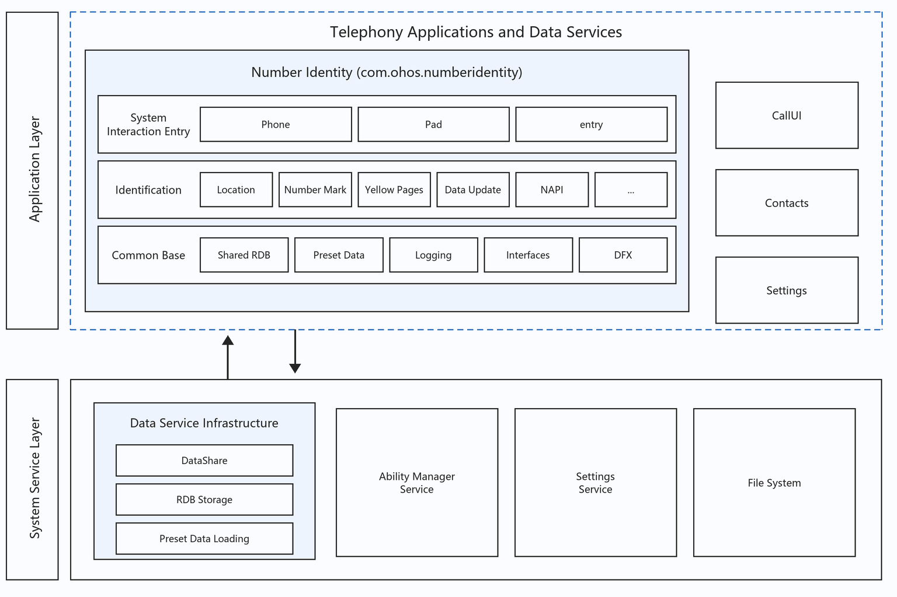
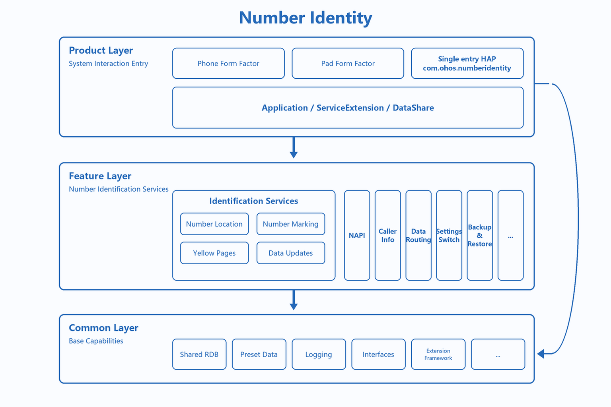
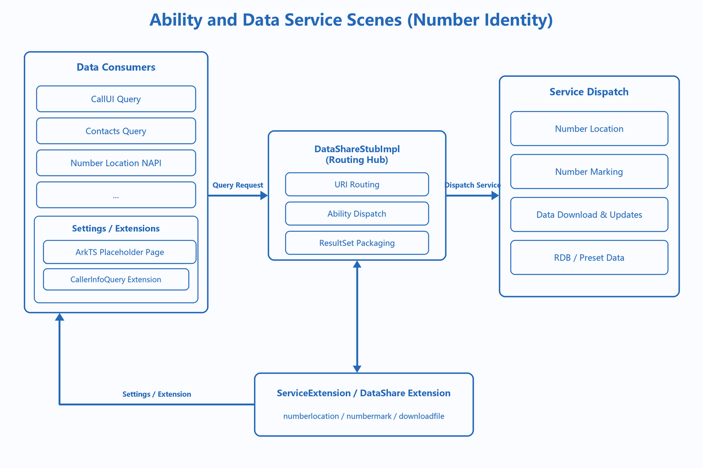
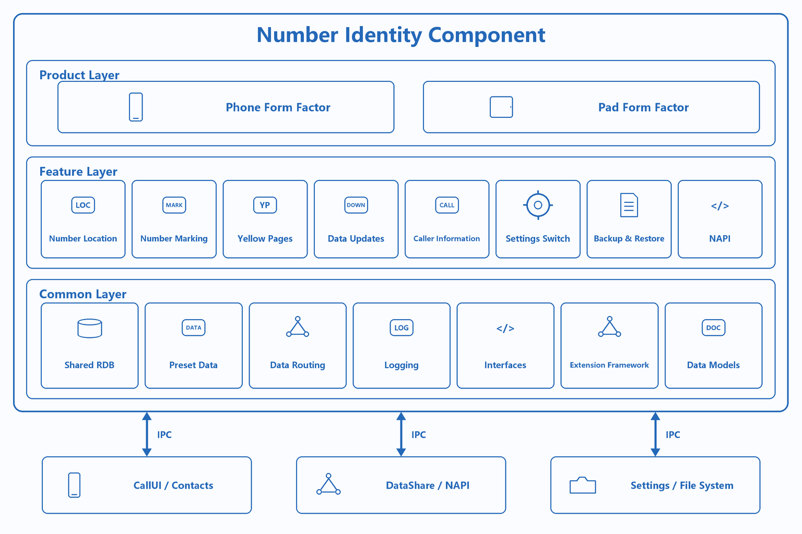
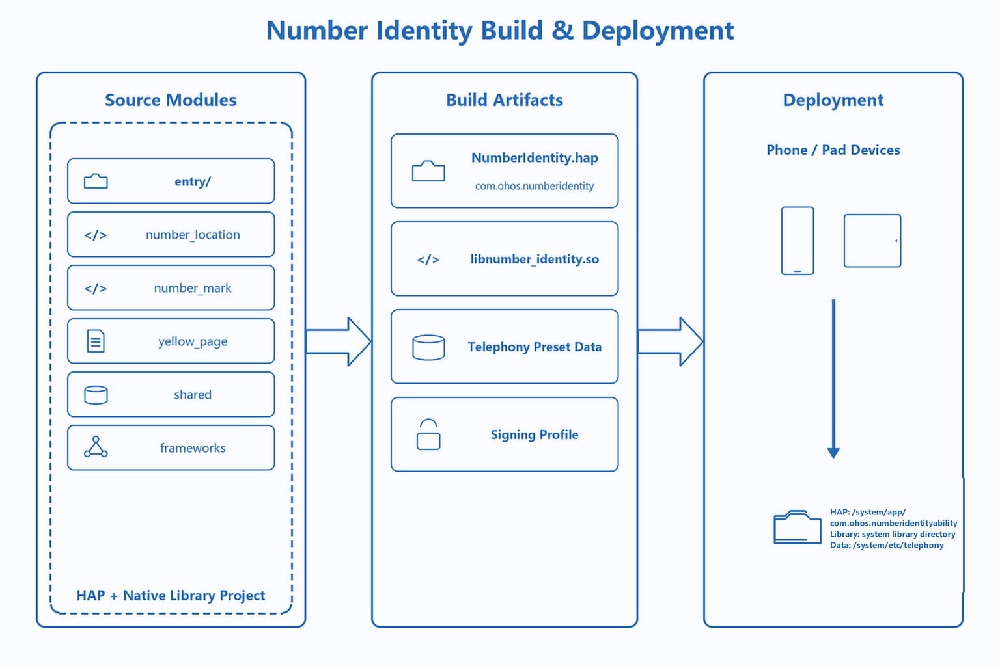

# Number Identity

## Introduction
**Number Identity** (bundle name: `com.ohos.numberidentity`) is a **number identity component** in the OpenHarmony telephony subsystem. It provides number location (attribution) query, number marking (caller identification), yellow-page recognition, caller-info query extension, and related local storage / DataShare services.

This is a preinstalled system component, deployed as a **system HAP plus native shared library**. Number marking and identification depend on the device's **local database / data files**. Results are read from those local sources, **with no online identification**. Prebuilt data files in the repository are **`etc/numberlocation.data`** and **`etc/yellowpage.data`**; on device they are installed under **`system/etc/telephony/`**.

### Core Capabilities

**Number Location Query**
- Parses local prebuilt/updated data files (`numberlocation.data` / `numberlocation.dat`) to return province/city/carrier information.
- `NumberLocationManager`, `MobilePhoneNumber`, and `FixPhoneNumber` implement mobile-segment matching, landline area-code matching, and number-format handling.
- Exposed via DataShare URI `com.ohos.numberlocationability` and NAPI `getNumberLocation`.

> Number Identity is positioned as a telephony data-service component. DataShare core logic is implemented in C++, not as a pure ArkTS app.

**Number Marking and Yellow Page**
- Supports user marking of unknown numbers (spam, fraud, advertising, and so on) into the `number_mark` table.
- Yellow-page data is parsed from `yellowpage.data` by `yellow_page` and imported into RDB, taking priority over community marks.
- The current production query order is local yellow pages → local user marks. `number_identity_switch` only gates the post-miss switch check. Intelligent-library import/storage and HSDR Helper code remain in the project, but are not connected to the main `QueryByPhoneNumber` path.

**DataShare Data Service**
- Unified `NumberIdentityDataShareStubImpl` routes three DataShare Extensions:
  - `com.ohos.numberlocationability` → location query
  - `com.ohos.numbermarkability` → number-mark query, update, delete, and batch import
  - `com.ohos.downloadfileability` → data download / update

**Caller Info Query Extension**
- `CallerInfoQueryExtensionAbility` supports third-party extensions for enterprise caller info.
- Extension declarations and Context types are exposed via `interfaces/kits/`.

**Data Update and Lifecycle**
- `DownloadFileWorkSheduler` periodically downloads number-location / yellow-page data files according to the configured network policy. Downloaded data is stored locally; identification queries do not make online requests.
- `NumberIdentityServiceExtAbility` supports IPC import of number-mark packages.
- `BackupExtension` provides backup/restore; RDB upgrades migrate automatically.

### Relationship with CallUI and Contacts

Number Identity, CallUI, and Contacts are telephony-ecosystem components. CallUI and Contacts **consume** data services provided by Number Identity.

**Events and call relationships**:
1. Number Identity runs as an independent process; the native `number_identity` shared library registers the DataShare creator on load.
2. CallUI and Contacts query number information cross-process via DataShare Helper or NAPI.
3. Number Identity does not interact with call UI directly; it provides indirect data services via DataShare / NAPI.

> Example of a typical incoming-call mark display flow:
> - CallUI receives an incoming call and obtains the caller number;
> - Queries `com.ohos.numbermarkability` via DataShare;
> - `NumberMarkAbility` queries yellow-page / mark data by priority;
> - Returns `NumberMarkInfo` for CallUI to display on the call screen.

## Architecture

Number Identity uses a layered, modular design and collaborates with consumers such as CallUI and Contacts.

### Position in the System

Number Identity sits in the application / data-service layer. It provides number identity capabilities to CallUI and Contacts through DataShare and NAPI, and depends on RDB plus prebuilt data for local parsing.



### Layered Design

The overall design can be divided into a product layer (entry HAP), a feature layer (location / mark / yellow page), and a common layer (RDB / NAPI / prebuilt data), as shown below:



| Layer | Main directories / components | Description |
| ---- | --------------- | ---- |
| Product / application entry | `entry/` | HAP packaging, ArkTS placeholder page, ServiceExtension, DataShare declarations, backup extension |
| Feature / number-identity business | `number_location/`, `number_mark/`, `yellow_page/` | Location parsing, mark query and maintenance, yellow-page import, data download |
| Common / base capabilities | `shared/`, `etc/`, `utils/`, `frameworks/`, `interfaces/` | RDB, prebuilt data, logging, NAPI, CallerInfoQuery extension and type definitions |

### Ability and Data Service Scenes

Consumers enter via DataShare / NAPI. StubImpl routes to the corresponding Ability, which accesses RDB and prebuilt data:



**Data flow overview**:

```text
CallUI / Contacts / NAPI
  → DataShare Helper / getNumberLocation
  → NumberIdentityDataShareStubImpl
  → NumberLocationAbility / NumberMarkAbility / DownloadFileAbility
  → shared RDB + etc prebuilt data
  → ResultSet / NumberMarkInfo return
```

### Component and External Dependencies

Internally the component is organized by product / feature / common capabilities. Cross-process collaboration uses DataShare, NAPI, the Settings service, and the file system:



### Module Description

| Module | Path | Description |
| ---- | ---- | ---- |
| Application entry | entry/src/main/ets/Application/ | NumberLocationAbilityStage process init |
| ArkTS placeholder page | entry/src/main/ets/pages/ | Index.ets currently contains only an empty page skeleton |
| Domain service | entry/src/main/ets/service/ | NumberIdentityServiceExtAbility IPC service |
| DataShare declarations | entry/src/main/ets/DataShareExtAbility/ | TS placeholders; real logic in C++ |
| Data update scheduler | entry/src/main/ets/DataShareExtAbility/DownloadFileWorkSheduler.ts | Triggers local data-file downloads and updates according to the network policy |
| Backup extension | entry/src/main/ets/backup/ | BackupExtension |
| Number location | number_location/ | Manager, Parser, Ability, DownloadFile |
| Number mark | number_mark/ | NumberMarkAbility, CallerInfo, mark query and maintenance |
| Yellow page | yellow_page/ | YellowPageParser data import |
| Database and models | shared/ | RDB Helper, DDL, Models, JSON/Pinyin/HSDR utilities |
| Prebuilt data | etc/ | numberlocation.data, yellowpage.data |
| NAPI | frameworks/js/ | numberidentity / numberlookup |
| Extension framework | frameworks/extension/ | CallerInfoQueryExtension |
| Interfaces | interfaces/ | innerkits / kits |
| Logging | utils/log/ | Unified logging macros and error codes |

## Build

Number Identity supports dual build systems: standalone Hvigor HAP build, and system GN integration for HAP + shared library + prebuilt data.



### Environment Requirements
- OpenHarmony / HarmonyOS SDK (the standalone HAP project uses `compileSdkVersion` 23 and `compatibleSdkVersion` / `targetSdkVersion` 20)
- OpenHarmony source tree (component path: `base/telephony/number_identity`)
- DevEco Studio or Hvigor; system GN toolchain
- Signing configuration for the system-source build (see `signature/pm.gni`; certificates and profiles are supplied by the product build environment)

### Build Commands

1. **System GN build**

Run from the OpenHarmony source-tree root:

```bash
./build.sh --product-name {product_name} --build-target number_identity --ccache
```

2. **DevEco / Hvigor standalone build**

```bash
hvigorw assembleHap
```

> **Note**: For standalone development, copy the project to `base/telephony/number_identity` and build with the system, or configure system signing for Hvigor standalone build.

### Build Outputs

| Output | Description |
| ---- | ---- |
| NumberIdentity.hap | entry module package; the system GN configuration installs it to `/system/app/com.ohos.numberidentityability` |
| libnumber_identity.so | Feature + common shared library |
| etc telephony data | `etc/` prebuilt data installed to `/system/etc/telephony/` |

`bundle.json` declares ownership under the telephony subsystem. Build groups include `fwk_group` (NAPI / extension / etc) and `service_group` (HAP / so).

## Developing Number Identity

Number Identity uses **ArkTS + C++**. DataShare core logic is in C++; ArkTS handles Extension declarations and service orchestration. `pages/Index.ets` currently contains only an empty page skeleton. For future ArkTS page development, see [ArkUI Development Overview](https://gitcode.com/openharmony/docs/blob/master/en/application-dev/ui/arkts-ui-development-overview.md).

### Development Based on Existing Modules

Typical scenarios: add local query dimensions, extend CallerInfoQuery, or customize local data-file update strategies.

**Extending DataShare query**
1. Add query-path handling in the corresponding Ability (for example `NumberMarkAbility`).
2. Route via `NumberIdentityDataShareStubImpl` URI dispatch.
3. Wrap results with Bridge classes.

**Adding NAPI APIs**
1. Register new APIs under `frameworks/js`.
2. Access the corresponding URI through `DataShareHelper`.
3. Update type declarations in `interfaces/`.

**Extending CallerInfoQuery**
1. Implement `CallerInfoQueryExtensionAbility` in a third-party app.
2. Return enterprise caller info in `onQueryCallerInfo(number)`.
3. The system invokes it through the `CallerInfoQueryExtension` framework over IPC.

### Developing New Features

Typical scenarios: add local identification dimensions, data-file update strategies, or external Kits.

1. Add/extend C++ modules in the feature layer and update `BUILD.gn`.
2. For new DataShare URIs, update StubImpl routing and `module.json5`.
3. For external exposure, update `interfaces/` and NAPI registration.
4. Add gtest / fuzz coverage under `test/`.

## Directory
```text
number_identity
├─AppScope                              # App-level config and multi-language resources
│  ├─app.json                           # App profile used by the system GN build
│  ├─app.json5                          # bundleName and version used by Hvigor
│  └─resources/                         # Global string resources
├─entry                                 # HAP entry module
│  ├─src/main/                          # Main source directory
│  │  ├─ets/                            # ArkTS business source
│  │  │  ├─Application/                 # AbilityStage process init
│  │  │  ├─DataShareExtAbility/         # DataShare declarations and data-update WorkScheduler
│  │  │  ├─service/                     # NumberIdentityServiceExtAbility
│  │  │  ├─pages/                       # ArkTS placeholder (currently an empty page skeleton)
│  │  │  ├─common/                      # Constants, logging, connection helpers
│  │  │  └─backup/                      # BackupExtension restore support
│  │  ├─resources/                      # Module resources, multi-language, and so on
│  │  ├─module.json                     # Module profile used by the system GN build
│  │  └─module.json5                    # Ability, permission, and DataShare declarations used by Hvigor
│  ├─build-profile.json5                # Module-level build config
│  └─obfuscation-rules.txt              # Obfuscation rules
├─number_location/                      # Number location (C++)
├─number_mark/                          # Number mark (C++)
├─yellow_page/                          # Yellow-page parser (C++)
├─shared/                               # RDB / Models / shared utilities
├─frameworks/                           # NAPI and CallerInfoQuery extension
├─interfaces/                           # innerkits / kits public interfaces
├─etc/                                  # Preset data (on-device: system/etc/telephony/)
├─utils/log/                            # Shared log macros and error codes
├─figures/                              # Architecture diagrams
│  ├─numberidentity_in_os.png           # Position in the system (zh)
│  ├─numberidentity_architecture.png    # Layered architecture (zh)
│  ├─numberidentity_ability.png         # Ability and data-service scenes (zh)
│  ├─numberidentity_ipc.png             # Component and external dependencies (zh)
│  ├─numberidentity_build.png           # Build and deployment (zh)
│  ├─numberidentity_in_os_en.png        # Position in the system (en)
│  ├─numberidentity_architecture_en.png # Layered architecture (en)
│  ├─numberidentity_ability_en.png      # Ability and data-service scenes (en)
│  ├─numberidentity_ipc_en.png          # Component and external dependencies (en)
│  └─numberidentity_build_en.png        # Build and deployment (en)
├─test/                                 # gtest / fuzztest
├─signature/                            # System GN signing config (pm.gni)
├─hvigor/                               # Build tool config
├─BUILD.gn                              # System GN build entry
├─bundle.json                           # Component ownership and build groups
├─build-profile.json5                   # Project-level SDK / signing / product config
├─oh-package.json5                      # Dependencies and package info
├─OAT.xml                               # Open-source compliance audit
├─LICENSE                               # Open-source license
├─README_zh.md                          # Chinese README
└─REAMDE_en.md                          # English README
```

## Constraints
- Languages: ArkTS + C++
- Subsystem: telephony
- Deploy path: `base/telephony/number_identity`
- Device types: `default`, `tablet` (see `module.json5`)
- Identification: local database / data files only, no online identification
- Preset data on device: `system/etc/telephony/`
- Local database: `/data/storage/el1/database/number_identity.db`
- Requires system permissions such as `MANAGE_SETTINGS` for telephony settings

## Contribution

Contributions of code, documentation, and more are welcome. For the contribution process, see [Contribute](https://gitcode.com/openharmony/docs/blob/master/en/contribute/contribution.md).

## Related Repositories
- [applications_call](https://gitcode.com/openharmony/applications_call) (consumer of number-identification data, including the call UI)
- [telephony_core_service](https://gitcode.com/openharmony/telephony_core_service) (telephony core services)
- [telephony_call_manager](https://gitcode.com/openharmony/telephony_call_manager) (call management service)
